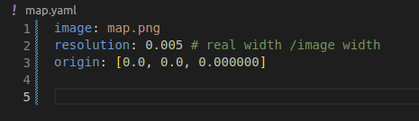
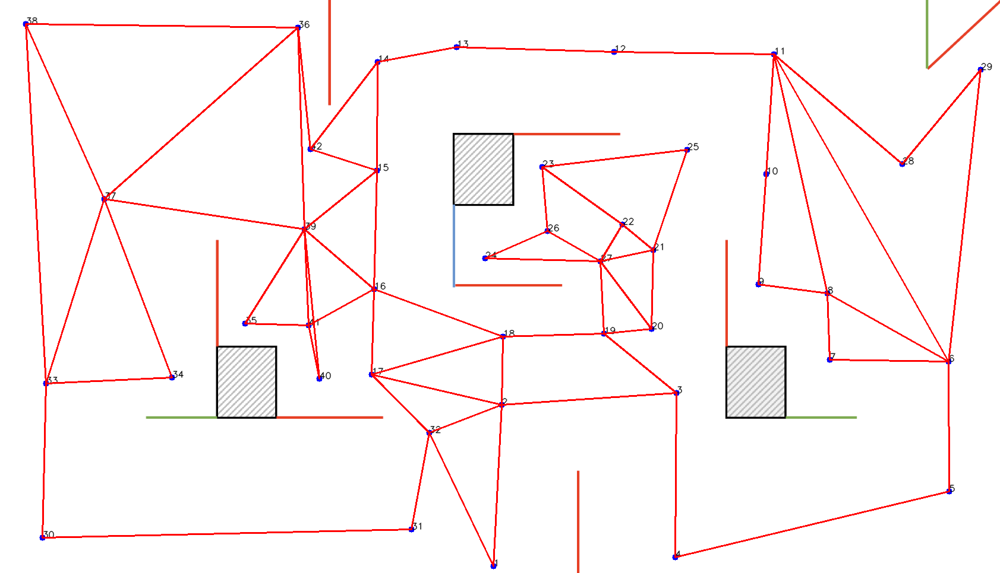

# glaobal_path_planner
KAIST EE405A 2023

## How to generate global node-link graph CSV file
1. Edit your [map.yaml](./map.yaml) file

- image: relative path to the map image from the yaml file
- resolution: resolution of the map (resolution = [real map size]/[image size])
- origin: origin of the map

2. Load your map and generate node-link graph
```
python3 image_to_csv.py
```
- node (blue points with black IDs): left click the point
- link (red lines): scroll click two points that you want to connect

To finish and save the file, you can terminate the code by "ctrl+c". The node-link graph will be saved in './points.csv' file.

## Node-link CSV file
- id     [int]:       ID of the node
- x y    [double]:    Position of the node in the global map (real-scale)
- start  [bool]:      If the point is the robot's starting point
- mine   [bool]:      If the point is where the mines are located
- linked [list<int>]: IDs of the nodes that are linked to the node.

You can edit the 'start' and 'mine' values in the CSV file to use them as semantic information for navigating towards the mine.